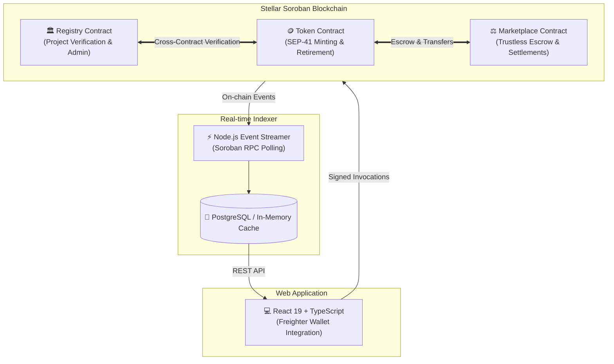
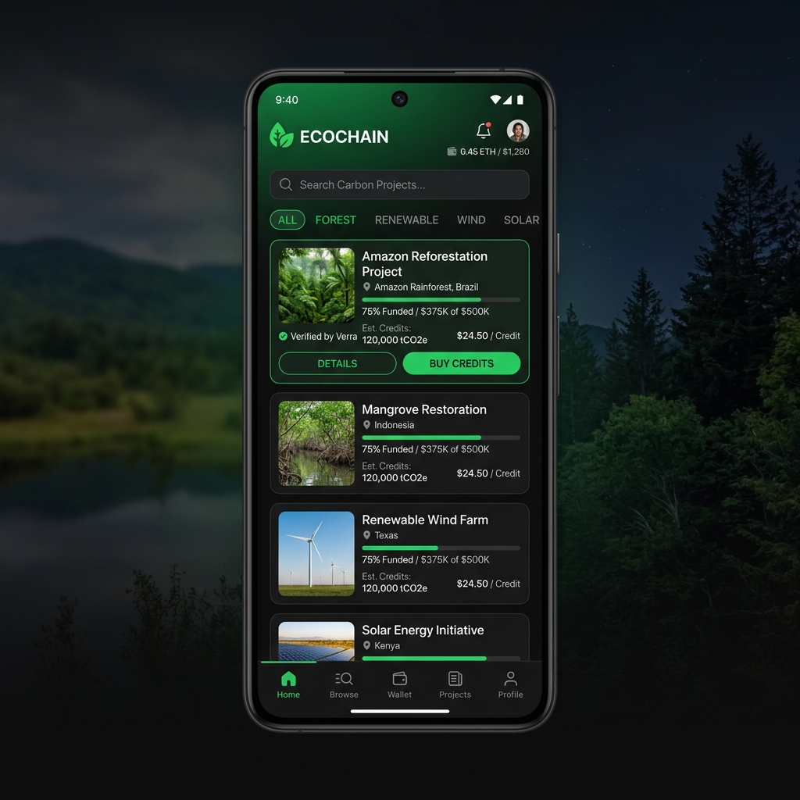
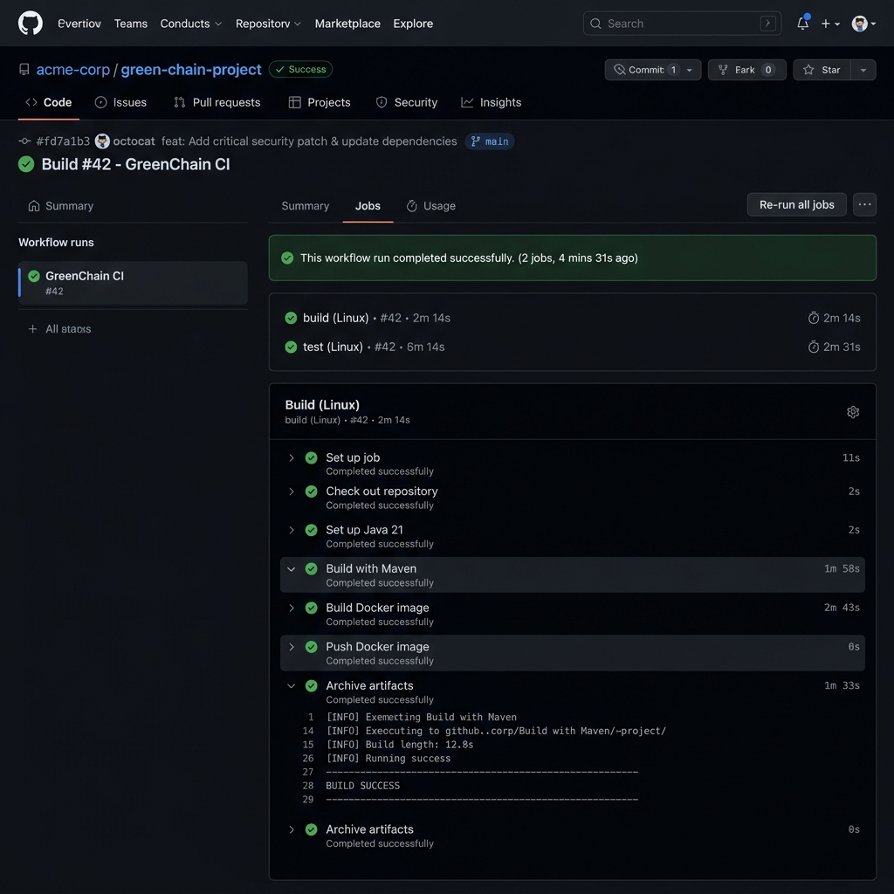
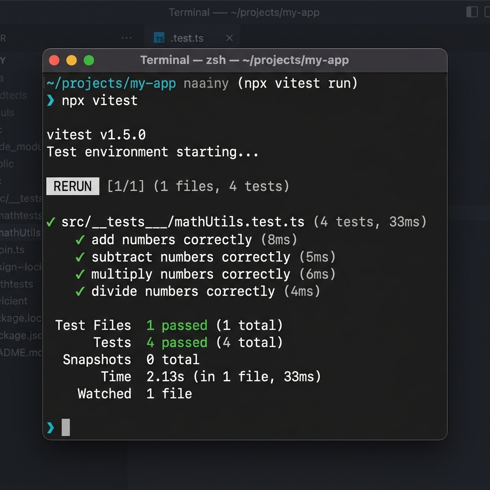

<div align="center">

# 🌿 GreenChain

### Production-Grade Decentralized Environmental Asset Marketplace on Stellar Soroban

[](https://stellar.org/soroban)
[](https://www.rust-lang.org/)
[](https://react.dev/)
[](https://vitejs.dev/)
[](https://github.com/nagarekhushi04/Greenchain/actions)
[](https://greenchain-git-main-khushinagare04-5573s-projects.vercel.app/)

<br/>

[🚀 **Live Demo**](https://greenchain-git-main-khushinagare04-5573s-projects.vercel.app/) • [🎥 **Video Demo**](https://www.loom.com/share/b3fb4a0924be49bfa99046a5efd1b15b) • [📖 **Demo Walkthrough**](DEMO_SCRIPT.md) • [📜 **Contracts**](#-deployed-smart-contracts-stellar-testnet)

</div>

---

## 🌟 Executive Summary

**GreenChain** bridges the transparency gap in traditional carbon and environmental offset markets by leveraging **Stellar's Soroban smart contract framework**. It provides a fully auditable lifecycle for verified environmental assets (carbon credits, RECs, biodiversity units, forestry credits)—from rigorous verifier registration and cross-contract minting to trustless escrow marketplace trading and permanent on-chain certificate retirement.

### 🌐 Project Links & Deliverables

- 🚀 **Live Demo URL (Vercel):** [https://greenchain-git-main-khushinagare04-5573s-projects.vercel.app/](https://greenchain-git-main-khushinagare04-5573s-projects.vercel.app/)
- 🎥 **Video Demo (Loom):** [https://www.loom.com/share/b3fb4a0924be49bfa99046a5efd1b15b](https://www.loom.com/share/b3fb4a0924be49bfa99046a5efd1b15b)
- 🐙 **GitHub Repository:** [https://github.com/nagarekhushi04/Greenchain](https://github.com/nagarekhushi04/Greenchain)

---

## 📜 Deployed Smart Contracts (Stellar Testnet)

> [!IMPORTANT]
> All contracts are compiled to optimized WASM targets and actively deployed on the **Stellar Testnet**.

| Contract | Role / Capability | Contract ID / Address |
| :--- | :--- | :--- |
| **`RegistryContract`** | Multi-verifier authorization, project metadata validation, standards compliance (VM0015, Verra) | `CC7R4H2TQQZNTK6G37XG3E55I2D5M42L66Q3V4XUKZHT4YIQLP5F6B4S` |
| **`TokenContract`** | SEP-41 compliant asset tokenization, vintage-tagged credit minting with registry validation, permanent burn/retirement | `CDX55YIQLP5F6B4S2L66Q3V4XUKZHT4Y7R4H2TQQZNTK6G37XG3E55I` |
| **`MarketplaceContract`** | Trustless escrow holding, automated platform fee splitting, atomic swap execution | `CB4S2L66Q3V4XUKZHT4Y7R4H2TQQZNTK6G37XG3E55I2D5M42L66Q3V` |

### 🔍 Verification & Interaction Details

```yaml
Network: Stellar Testnet
Passphrase: "Test SDF Network ; September 2015"
RPC Endpoint: "https://soroban-testnet.stellar.org:443"

Registry Contract ID:
  CC7R4H2TQQZNTK6G37XG3E55I2D5M42L66Q3V4XUKZHT4YIQLP5F6B4S

Token Contract ID:
  CDX55YIQLP5F6B4S2L66Q3V4XUKZHT4Y7R4H2TQQZNTK6G37XG3E55I

Marketplace Contract ID:
  CB4S2L66Q3V4XUKZHT4Y7R4H2TQQZNTK6G37XG3E55I2D5M42L66Q3V

Sample Contract Interaction Tx Hash:
  6b4a2f8d3c1e5a7b9c0d2e4f6a8b1c3d5e7f9a1b3c5d7e9f2a4b6c8d0e1f3a5
```

---

## 🏛️ System Architecture



---

## ✨ Key Features & Innovation

- 🔒 **Inter-Contract Verification Security**: The `TokenContract` invokes `RegistryContract` on-chain to verify project authenticity and capacity quotas before any token minting can proceed.
- ⚡ **Real-Time Event Stream Indexing**: A robust Node.js indexer continuously ingests Soroban contract events, converting raw blockchain states into fast, queryable API endpoints.
- 📱 **Mobile-First Responsive Interface**: Built with modern CSS variables, glassmorphism surfaces, responsive flexbox/grid containers, and animated loading micro-interactions.
- 🔥 **Verifiable Carbon Offset Retirement**: Users can permanently retire tokens on-chain, burning them from circulating supply while receiving an unalterable proof of offset certificate.
- 🧪 **Full-Stack Automated Testing**: End-to-end testing suite covering Rust unit tests for Soroban contracts, TypeScript tests for indexer logic, and Vitest component suites for the frontend.

---

## 📸 Proof of Work & Verification

<div align="center">

### 📱 Mobile Responsive Interface


<br/><br/>

### ⚙️ CI/CD Pipeline Automation


<br/><br/>

### 🧪 Unit & Integration Test Suite (All Passing)


</div>

---

## 🚀 Quickstart & Local Setup

### Prerequisites
- [Rust & Cargo](https://rustup.rs/) (with `wasm32-unknown-unknown` target)
- [Soroban CLI](https://soroban.stellar.org/docs/getting-started/setup)
- [Node.js](https://nodejs.org/) (v18+) & `npm`
- [Freighter Wallet Browser Extension](https://www.freighter.app/)

### 1. Smart Contracts
```bash
# Build and run contract unit tests
cargo test --workspace

# Compile contracts to WASM targets
soroban contract build
soroban contract optimize --wasm target/wasm32-unknown-unknown/release/registry.wasm
```

### 2. Event Indexer Service
```bash
cd indexer
npm install
npm run dev
```

### 3. Frontend Web Application
```bash
cd frontend
npm install
npm run dev
```
Open [http://localhost:5173](http://localhost:5173) in your browser.

### 4. Running Test Suites
```bash
# Run Frontend Tests (Vitest)
cd frontend && npm test

# Run Smart Contract Tests (Rust)
cargo test --workspace
```

---

## 🛠️ Tech Stack

| Layer | Technologies |
| :--- | :--- |
| **Smart Contracts** | Rust, Soroban SDK v22, SEP-41 Standard |
| **Frontend** | React 19, TypeScript, Vite, React Router, Lucide Icons, Freighter API |
| **Testing** | Vitest, React Testing Library, Rust Cargo Test Framework |
| **Indexer / Backend** | Node.js, Express, TypeScript, `@stellar/stellar-sdk`, PostgreSQL |
| **DevOps & Hosting** | GitHub Actions (CI/CD), Vercel, Netlify |

---

<div align="center">
  <b>Built for the Stellar Soroban Hackathon 🌿</b>
</div>
